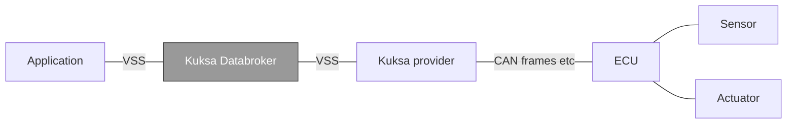

<!-- Improved compatibility of back to top link: See: https://github.com/othneildrew/Best-README-Template/pull/73 -->

<a name="readme-top"></a>

<!-- PROJECT LOGO -->
<br />
<div align="center">
  <a href="https://github.com/eclipse-kuksa/kuksa-databroker">
    
  </a>

<h3 align="center">Eclipse Kuksa&trade; Databroker</h3>

  <p align="center">
    Kuksa Databroker is a gRPC service acting as a broker of vehicle data / data points / signals.
    <br />
    <a href="./doc/user_guide.md"><strong>Explore the docs »</strong></a>
    <br />
    <br />
    <a href="https://github.com/eclipse-kuksa/kuksa-databroker/issues">Report Bug</a>
    ·
    <a href="https://github.com/eclipse-kuksa/kuksa-databroker/issues">Request Feature</a>
    ·
    <a href="https://matrix.to/#/#kuksa-val_community:gitter.im">Chat</a>
  </p>
</div>

<!-- TABLE OF CONTENTS -->
<details>
  <summary>Table of Contents</summary>
  <ol>
    <li>
      <a href=".#Intro">Intro</a>
      <ul>
        <li><a href="#features">Features</a></li>
      </ul>
    </li>
    <li>
      <a href="#getting-started">Getting Started</a>
      <ul>
        <li><a href="#prerequisites">Prerequisites</a></li>
        <li><a href="#starting-databroker">Starting Databroker</a></li>
        <li><a href="#reading-and-writing-vss-data-using-the-cli">Reading and writing VSS data using the CLI</a></li>
    </li>
    <li><a href="#usage">Usage</a></li>
    <li><a href="#building">Building</a></li>
    <li><a href="#performance">Performance</a></li>
    <li><a href="#additional-documentation">Additional Documentation</a></li>
    <li><a href="#contributing">Contributing</a></li>
    <li><a href="#license">License</a></li>
    <li><a href="#contact">Contact</a></li>
  </ol>
</details>

<!-- ABOUT THE PROJECT -->

## Intro

The [COVESA Vehicle Signal Specification](https://covesa.github.io/vehicle_signal_specification/) (VSS) defines the names and semantics of a large set of _data entries_ that represent the current and/or intended state of a vehicle's sensors and actuators organized in a tree-like structure. For example, the vehicle's current speed is represented by the `Vehicle.Speed` entry.

However, VSS does not define how these signals are to be collected and managed within a vehicle, nor does it prescribe how other components in the vehicle can read or write signal values from and to the tree.

**Kuksa Databroker** is a resource efficient implementation of the VSS signal tree and is intended to be run within a vehicle on a microprocessor based platform. It allows applications in the vehicle to interact with the vehicle's sensors and actuators using a uniform, high level gRPC API for querying signals, updating values of sensors and actuators and getting notified about changes to signals of interest.

<!-- black box diagram -- inputs/outputs -->



At the right end, Kuksa providers implement the link between the Databroker and a vehicle's Electronic Control Units (ECU) to which the hardware sensors and actuators are physically attached.

Data is usually exchanged with ECUs by means of a CAN bus or Ethernet based protocols like SOME/IP. Providers translate between the low level messages used by these protocols and the Databroker's high level gRPC API calls to update a sensor's current reading or to forward a set-point value to an actuator via its controlling ECU.

<p align="right">(<a href="#readme-top">back to top</a>)</p>

### Features

- 100% Open Source (Apache 2.0 license)
- Written in Rust with an easy-to-use language agnostic gRPC interface
- Lightweight (<4 MB statically compiled), allowing it to run on even small vehicle computers

<p align="right">(<a href="#readme-top">back to top</a>)</p>

### APIs supported by Databroker

Kuksa Databroker provides [gRPC](https://grpc.io/) based API endpoints which can be used by
clients to interact with the server. gRPC services are specified by means of `.proto` files which define the services and the data
exchanged between server and client.
[Tooling](https://grpc.io/docs/languages/) is available for most popular programming languages to create
client stubs for invoking the services.
The Databroker uses gRPC's default HTTP/2 transport and [protocol buffers](https://developers.google.com/protocol-buffers) for message serialization.
The same `.proto` file can be used to generate server skeleton and client stubs for other transports and serialization formats as well.

HTTP/2 is a binary replacement for HTTP/1.1 used for handling connections, multiplexing (channels) and providing a standardized way to add headers for authorization and TLS for encryption/authentication.
It also supports bi-directional streaming between client and server.

Kuksa Databroker implements the following gRPC service interfaces:

- Enabled on Databroker by default [kuksa.val.v2.VAL](proto/kuksa/val/v2/val.proto)
- Enabled on Databroker by default [kuksa.val.v1.VAL](proto/kuksa/val/v1/val.proto) (Deprecated!)
- Disabled on Databroker by default [sdv.databroker.v1.Broker](proto/sdv/databroker/v1/broker.proto) (Deprecated!)
- Disabled on Databroker by default [sdv.databroker.v1.Collector](proto/sdv/databroker/v1/collector.proto) (Deprecated!)

In addition to the gRPC interfaces the Kuksa Databroker also supports a subset of the [COVESA VISS v2 Protocol[(https://github.com/COVESA/vehicle-information-service-specification)
using WebSocket.
Please visit the [user guide](doc/user_guide.md) for more information on how the interfaces can be enabled and configured in the Databroker.
Please visit the [protocol documentation](doc/protocol.md) for more information on the APIs.

<p align="right">(<a href="#readme-top">back to top</a>)</p>

<!-- GETTING STARTED -->

## Getting started

The quickest possible way to get Kuksa Databroker up and running.

> :memo: **Note:** The examples in this section do not use TLS nor access control. Please refer to the [User Guide](./doc/user_guide.md) for more sophisticated usage examples.

### Prerequisites

- [Docker Engine](https://docs.docker.com/engine/install/) or [Podman](https://podman.io/docs/installation)
- A custom Docker _bridge_ network
  ```sh
  docker network create kuksa
  ```

### Starting Databroker

1. Start Databroker in a container attached to the _kuksa_ bridge network using hostname _Server_:

   ```sh
   docker run -it --rm --name Server --network kuksa ghcr.io/eclipse-kuksa/kuksa-databroker:main --insecure
   ```

   > :bulb: **Tip:** You can stop the container using `ctrl-c`.

*Note that not all APIs are enabled by default, see [user guide](doc/user_guide.md) and*
*[protocols](doc/protocol.md) for more information!*

### Reading and writing VSS data using the CLI (interactive)

1. Start the CLI in a container attached to the _kuksa_ bridge network and connect to the Databroker container:

   The databroker supports the lastest new API `kuksa.val.v2` and `kuksa.val.v1` by default, `sdv.databroker.v1` must be enabled using `--enable-databroker-v1`. Per default the databroker-cli uses the `kuksa.val.v1` interface, which can be changed by supplying the `--protocol` option when starting. Choose either `kuksa.val.v1` or `sdv.databroker.v1`, as databroker-cli still does not support  `kuksa.val.v2`.

   ```sh
   # in a new terminal
   docker run -it --rm --network kuksa ghcr.io/eclipse-kuksa/kuksa-databroker-cli:main --server Server:55555
   ```

   The CLI provides an interactive prompt which can be used to send commands to the Databroker.

   ```console
     ⠀⠀⠀⢀⣤⣶⣾⣿⢸⣿⣿⣷⣶⣤⡀
     ⠀⠀⣴⣿⡿⠋⣿⣿⠀⠀⠀⠈⠙⢿⣿⣦
     ⠀⣾⣿⠋⠀⠀⣿⣿⠀⠀⣶⣿⠀⠀⠙⣿⣷
     ⣸⣿⠇⠀⠀⠀⣿⣿⠠⣾⡿⠃⠀⠀⠀⠸⣿⣇⠀⠀⣶⠀⣠⡶⠂⠀⣶⠀⠀⢰⡆⠀⢰⡆⢀⣴⠖⠀⢠⡶⠶⠶⡦⠀⠀⠀⣰⣶⡀
     ⣿⣿⠀⠀⠀⠀⠿⢿⣷⣦⡀⠀⠀⠀⠀⠀⣿⣿⠀⠀⣿⢾⣏⠀⠀⠀⣿⠀⠀⢸⡇⠀⢸⡷⣿⡁⠀⠀⠘⠷⠶⠶⣦⠀⠀⢠⡟⠘⣷
     ⢹⣿⡆⠀⠀⠀⣿⣶⠈⢻⣿⡆⠀⠀⠀⢰⣿⡏⠀⠀⠿⠀⠙⠷⠄⠀⠙⠷⠶⠟⠁⠀⠸⠇⠈⠻⠦⠀⠐⠷⠶⠶⠟⠀⠠⠿⠁⠀⠹⠧
     ⠀⢿⣿⣄⠀⠀⣿⣿⠀⠀⠿⣿⠀⠀⣠⣿⡿
     ⠀⠀⠻⣿⣷⡄⣿⣿⠀⠀⠀⢀⣠⣾⣿⠟    databroker-cli
     ⠀⠀⠀⠈⠛⠇⢿⣿⣿⣿⣿⡿⠿⠛⠁     v0.4.1

   Successfully connected to http://Server:55555/
   sdv.databroker.v1 >
   ```

   > :bulb: **Tip:** The client retrieves metadata about the data entries that the Databroker knows about during startup. This allows for using `TAB`-completion of data entry names at the prompt.

1. Display help for supported commands
   ```sh
   help
   ```
   ```console
   connect [URI]            Connect to server
   get <PATH> [[PATH] ...]  Get signal value(s)
   set <PATH> <VALUE>       Set actuator signal
   subscribe <QUERY>        Subscribe to signals with QUERY
   feed <PATH> <VALUE>      Publish signal value
   metadata [PATTERN]       Fetch metadata. Provide PATTERN to list metadata of signals matching pattern.
   token <TOKEN>            Use TOKEN as access token
   token-file <FILE>        Use content of FILE as access token
   help                     You're looking at it.
   quit                     Quit
   ```
1. Get the vehicle's current speed

   ```sh
   get Vehicle.Speed
   ```

   ```console
   [get]  OK
   Vehicle.Speed: ( NotAvailable )
   ```

   > :memo: **Note** When Databroker starts up, all data entries are initialized to empty values. Thus, the vehicle speed is being reported as `NotAvailable`.

1. Set the vehicle's current speed

   ```sh
   publish Vehicle.Speed 100.34
   ```

   ```console
   [publish]  OK
   ```

1. Get the vehicle's current speed

   ```sh
   get Vehicle.Speed
   ```

   ```console
   [get]  OK
   Vehicle.Speed: 100.34
   ```

Run the cli with:

4. Exit the client
   ```sh
   quit
   ```


### Reading and writing VSS data using the CLI (non-interactive)
You can use the databroker-cli as non interactive client as well. If you call `help` on it then you get the available commands:

```sh
Usage: databroker-cli [OPTIONS] [COMMAND]

Commands:
  get      Get one or more datapoint(s)
  set      Set a datapoint
  publish  Publish a datapoint PATH VALUE
  actuate  Request an actuation PATH VALUE
  help     Print this message or the help of the given subcommand(s)

Options:
      --server <SERVER>      Server to connect to [default: http://127.0.0.1:55555]
      --token-file <FILE>    File containing access token
      --ca-cert <CERT>       CA certificate used to verify server certificate
  -p, --protocol <PROTOCOL>  [default: kuksa.val.v1] [possible values: kuksa.val.v1, sdv.databroker.v1]
  -h, --help                 Print help
  -V, --version              Print version
```
support of the commands for non-interactive mode for kuksa.val.v1 and sdv.databroker.v1:
| Operation                          | sdv.databroker.v1 | kuksa.val.v1 |
|------------------------------------|--------------------|---------------|
| `publish` to Databroker             | No                | Yes           |
| `set` datapoint in Databroker          | No                | No           |
| `actuate` request to Databroker             | No                 | Yes           |
| `get` datapoint from Databroker | Yes                | Yes            |

exmaple invocation:

```sh
  docker run -it --rm --net=host ghcr.io/eclipse-kuksa/kuksa-databroker-cli:main --protocol kuksa.val.v1 publish Vehicle.Speed 12
  Using kuksa.val.v1
  [publish]  OK
```

<p align="right">(<a href="#readme-top">back to top</a>)</p>

<!-- USAGE EXAMPLES -->

## Usage

Please refer to the [User Guide](./doc/user_guide.md) for details regarding how to run and interact with Kuksa Databroker.

<p align="right">(<a href="#readme-top">back to top</a>)</p>

## Building

Building Kuksa Databroker from source code requires

- a [Rust tool chain](https://www.rust-lang.org/tools/install)
- a local workspace containing the source code
  ```shell
  git clone https://github.com/eclipse-kuksa/kuksa-databroker.git
  ```

<p align="right">(<a href="#readme-top">back to top</a>)</p>

### Building Examples and Binaries

```sh
# in ${WORKSPACE}
cargo build --examples --bins
```

<p align="right">(<a href="#readme-top">back to top</a>)</p>

### Building release Binaries

```sh
# in ${WORKSPACE}
cargo build --bins --release
```

<p align="right">(<a href="#readme-top">back to top</a>)</p>

### Runing Databroker Test Cases

```shell
# in ${WORKSPACE}
cargo test --all-targets
```

<p align="right">(<a href="#readme-top">back to top</a>)</p>

## Performance
The Kuksa team has released an official tool to measure the latency and throughput of the Databroker for all supported APIs:
[kuksa-perf](https://github.com/eclipse-kuksa/kuksa-perf)

The use case measures the time it takes for a signal to be transferred from the Provider to the Signal Consumer
Signal Consumer(stream subscribe) <- Databroker <- Provider(stream publish)

Feel free to use it and share your results with us!

## Additional Documentation

Additional documentation is available in the [repository documentation folder](doc).

<p align="right">(<a href="#readme-top">back to top</a>)</p>

## Contributing

Please refer to the [Kuksa Contributing Guide](CONTRIBUTING.md).

<p align="right">(<a href="#readme-top">back to top</a>)</p>


<!-- KUKSA ANALYSIS -->
## Kuksa analysis
Extended [Kuksa analysis](./doc/kuksa_analysis.md) containing functional requirements, use cases diagrams, latest and new API definition `kuksa.val.v2` as well as new design discussions for future developments and improvements.

## License

Kuksa Databroker is provided under the terms of the [Apache Software License 2.0](LICENSE).

<p align="right">(<a href="#readme-top">back to top</a>)</p>

## Contact

Please feel free to create [GitHub Issues](https://github.com/eclipse-kuksa/kuksa-databroker/issues) for reporting bugs and/or ask questions in our [Gitter chat room](https://matrix.to/#/#kuksa-val_community:gitter.im).

<p align="right">(<a href="#readme-top">back to top</a>)</p>
