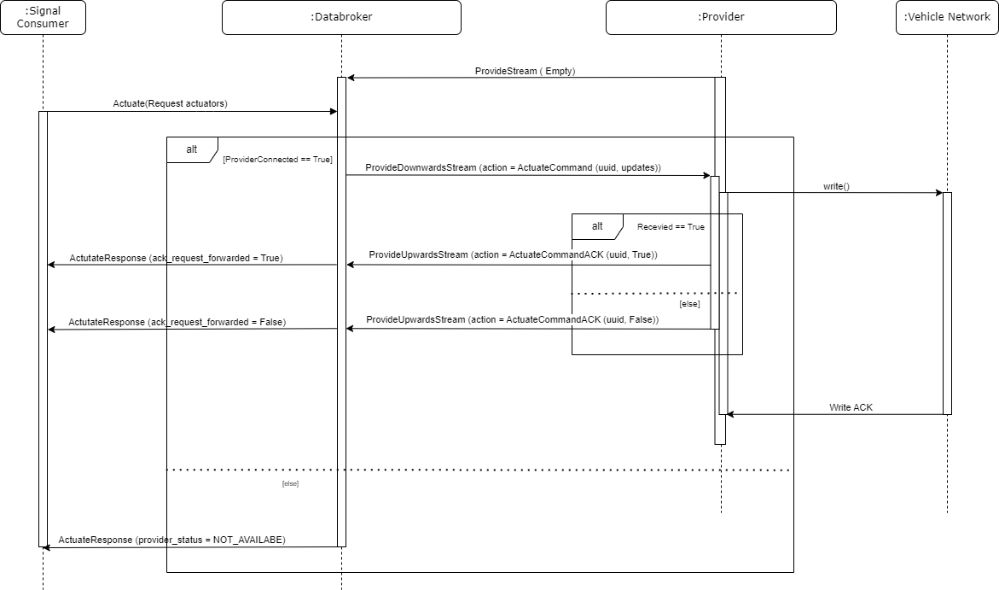

# KUKSA Use Cases

# Content
- [KUKSA Use Cases](#kuksa-use-cases)
- [Content](#content)
- [Use Cases status](#use-cases-status)
- [Use cases:](#use-cases)
  - [UC1](#uc1)
  - [UC2](#uc2)
  - [UC3](#uc3)
  - [UC4](#uc4)
  - [UC5](#uc5)
  
# Use Cases status
| Description                               | Status                       |
|-------------------------------------------|------------------------------|
| Implemented and Verified                  | 🟢                           |
| Approved, Not Yet Implemented             | 🟡                           |
| Long Term Goal                            | 🔴                           |

# Use cases:

## UC1
    Title: Signal consumber subscribes to all signal values.

    Status: 🟡

    Description: Signal Consumer subscribes on changed sensor values or actuator current values of all signals

**Primary Actor:** Signal Consumer

**Secondary Actors:** Databroker, Provider, Vehicle Network 

**Priority**: High

**Preconditions:**
 * Signal Consumer contains a valid authentication token to connect and perform calls to databroker.

**Special requirements:**
 * The use case must meet the Performance
 * What if provider died?

**Assumptions:**
 * Signal Consumer subscribes to all the possible sensor values or actuator current values to test special requirements.
 * Provider porvides signals values to Databroker as fast as receives data from the Vehicle Network.

**Postconditions:**
 * A subscription is created, and Signal Consumer receives streaming of signals.

**Sequence diagram:**

**Basic Flow:**
1.  The Provider opens bidirectional call with empty request to Databroker to "inform" the Databroker it exists.
2.	Signal Consumer subscribes to all the sensor values or current values of actuators.
3.	Databroker checks if there is a provider up and running.
    3.1 If Provider is connected
        3.1.1 Then Databroker sends a start signal command with an unique uuid per command.
        3.1.2 If the Provider recevied correctly the command
            3.1.2.1 Then the Provider returns a response containing the uuid of the previous command and True.
            3.1.2.1 Else the Provider returns a response containing the uuid of the previous command and False.
        3.1.3 The Provider starts sending a stream of values containing all the new signal values requested.
        3.1.4 The Databroker receives the new signal values and update its database.
        3.1.5 The Databroker sends the updated values stream back to the Signal Consumer.
    3.2 if Provider is not connected.
        3.2.1 ?
4.	Signal Consumer closes subscription to Databroker.
    4.1 The Databroker sends a stop signal command with the previous uuid.
    4.2 The provider stops reading signal values from the Vehicle Network.
5.	Use case finishes.

**Exceptions:**

## UC2
    Title: Signal Consumer actuates on an actuator.

    Status: 🟡

    Description: Signal Consumer actuates on an actuator.

**Primary Actor:** Kuksa client

**Secondary Actors:** Databroker, Provider, CAN Bus

**Priority:** High

**Preconditions:**
 * Signal Consumer contains a valid authentication token to connect and perform calls to databroker.

**Special requirements:**

**Assumptions:**

**Postconditions:**
* Signal Consumer receives a response whose status indicates the operation was successfully executed.
* Provider writes the new target value in CAN bus.

**Sequence diagram:**

**Basic Flow:**
1.  The Provider opens bidirectional call with empty request to Databroker to "inform" the Databroker it exists.
2.	Signal Consumer actuate on the actuators requested.
3.	Databroker checks if there is a provider up and running.
    3.1 If Provider is connected
        2.1.1 Then Databroker sends an actuate command with an unique uuid per command and the values to be updated.
        2.1.2 If the Provider recevied correctly the command
            2.1.2.1 Then the Provider returns a response containing the uuid of the previous command and True.
                    2.1.2.1.1 The Databroker returns to the Signal Consumer a response with a True acknowledgment.
            2.1.2.2 Else
                    2.1.2.2.1 The Databroker returns to the Signal Consumer a response with a False acknowledgment.
    3.2 if Provider is not connected.
        2.2.1 The Databroker returns to the Signal Consumer a response with a NOT_AVAILABLE provider status.
4.	Use case finishes.

**Exceptions:**

## UC3
    Title:

    Status: 🟡

    Description: Kuksa client gets sensor values or actuator current values of all signals.

**Primary Actor:** Kuksa client

**Secondary Actors:** Databroker, Provider, CAN Bus

**Priority:** High

**Preconditions:**
* Provider can read from CAN Bus.
* Provider starts sending sensor values or actuator current values to Databroker before the Client subscribes.
* Kuksa client contains a valid authentication token to connect and perform calls to databroker.

**Special requirements:**

**Assumptions:**
* Client wants to get to all the possible sensor values or actuator current values to test special requirements.

**Postconditions:**
* Client receives a vector with all datapoints requested.

**Sequence diagram:**

**Basic Flow:**
1.	Provider open CAN Bus connection and start receiving signal values.
2.	Provider sets sensor values or actuator current values to Databroker atomically. -> NFR (1.7)
3.	Kuksa client calls get call to all the sensor values or current values of actuators.
4.	Kuksa client response which contains a vector of datapoints.
5.	Use case finishes.

**Alternative Flows:**
* Flow 1.
4.	Kuksa client calls get call to all the sensor values or current values of actuators.
5.	Databroker return error response since provider is not connected???
6.	Use case finishes.

**Exceptions:**

## UC4
    Title:

    Status: 🟡

    Description: As a provider, I want to update atomically on Databroker, all sensor values as fast as possible.

**Primary Actor:** Provider

**Secondary Actors:** Databroker, CAN Bus

**Priority:** High

**Preconditions:**
* Provider can stablish a CAN Bus connection.

**Special requirements:**
* Provider sets sensor values to Databroker atomically. -> NFR (1.7)

**Assumptions:**
* There is an instance of Databroker up and running.

**Postconditions:**
* Databroker stores on database all the sensor values.

**Sequence diagram:**

**Basic Flow:**
1.	Provider open CAN Bus connection and start receiving signal values.
2.	Provider sets sensor values to Databroker atomically. -> NFR (1.7)

**Alternative Flows:**

**Exceptions:**

## UC5
    Title:

    Status: 🟡

    Description: As a provider, if I receive a target value update through a subscription to the databroker, I want to modify the target value on the CAN bus and update the current value to the databroker if the operation is successful.

**Primary Actor:** Provider

**Secondary Actors:** Databroker, CAN Bus

**Priority:** High

**Preconditions:**

**Special requirements:**

**Assumptions:**
* Provider can stablish a CAN Bus connection.
* There is an instance of Databroker up and running.
* Provider is aware of all possible signals to subscribe by calling up front get metadata.

**Postconditions:**
* Databroker receives a subscription stream to start receiving target values of actuators.

**Sequence diagram:**

**Basic Flow:**
1.	Provider subscribes to target values on Databroker.
2.	Provider receives target value notification upon previous subscription.
3.	Provider serializes VSS target value to CAN Bus and sends the value to the Bus.
4.	Provider receives response and set the new current value to Databroker.
5.	Databroker notifies Kuksa client with the result of the operation.
6.	Use case finishes.

**Alternative Flows**
* Flow 1.**
4.	Provider receives error response and set the previous current_value to Databroker.
5.	Databroker what should do? Check timestamp?

**Exceptions:**

