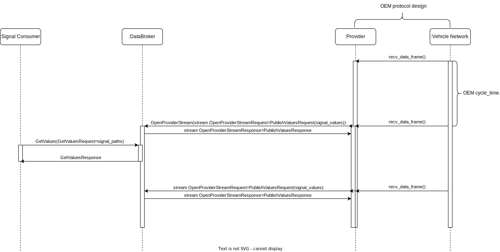
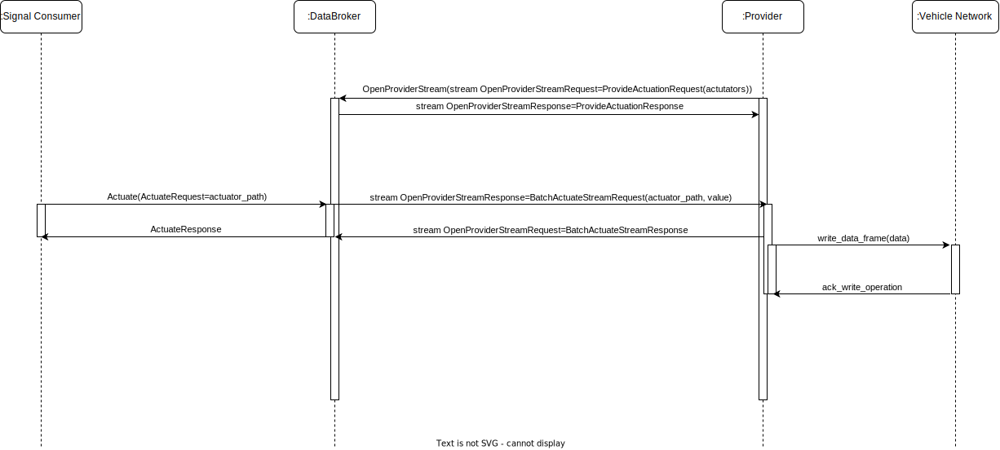
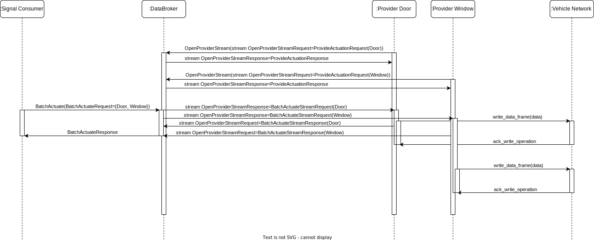

# KUKSA Use Cases

# Content
- [KUKSA Use Cases](#kuksa-use-cases)
- [Content](#content)
- [Use Cases status](#use-cases-status)
- [Use cases:](#use-cases)
  - [UC1](#uc1)
  - [UC2](#uc2)
  - [UC3](#uc3)
  - [UC4](#uc4)
  - [UC5](#uc5)
  - [UC6](#uc6)
  - [UC7](#uc7)
  - [UC8](#uc8)

# Use Cases status
| Description                               | Status                       |
|-------------------------------------------|------------------------------|
| Implemented and Verified                  | 🟢                           |
| Approved, Not Yet Implemented             | 🟡                           |
| Long Term Goal                            | 🔴                           |

# Use cases:

## UC1
    Title: Get sensor values.

    Status: 🟢

    Description: Signal consumer gets sensor and actuator values of signals.

**Primary Actor:** Signal consumer

**Secondary Actors:** Databroker, Provider, Vehicle Network

**Priority:** High

**Preconditions:**
 * Provider can read from Vehicle Network.
 * Signal Consumer contains a valid authentication token to connect and perform calls to Databroker.
 * Provider should have published some signal values to Databroker before calling GetValues.

**Special requirements:**

**Assumptions:**
* Singal Consumer should get exactly all signal values requested.

**Postconditions:**
* Signal Consumer receives a vector with all signals requested in same order as requested.

**Sequence diagram:**

**Basic Flow:**
1.  Provider opens bidirectional stream and sends a claim actuators request.
2.  Databroker stores the claim request.
3.  Provider starts publishing at a high frequency sensor and actuator values as soon as received from Vehicle network.
4.  Signal Consumer calls GetValues with signal paths.
5.  Databroker sends the response with signal values back to the Signal Consumer.
9.	Use case finishes.

**Exceptions:**

## UC2
    Title: Signal consumber subscribes by id(int32) to all signal values.

    Status: 🟢

    Description: Signal Consumer subscribes to all sensor and actuator values by ids. It gets notifications when values changed.

**Primary Actor:** Signal Consumer

**Secondary Actors:** Databroker, Provider, Vehicle Network

**Priority**: High

**Preconditions:**
 * Signal Consumer contains a valid authentication token to connect and perform calls to databroker.
 * Provider can read from Vehicle Network.
 * Provider constantly publishes new signal values.

**Special requirements:**
 * The use case must meet a high frequency notification rate.

**Assumptions:**
 * Signal Consumer subscribes to all possible sensor and actuator values.
 * Provider porvides signals values to Databroker as fast as receives data from the Vehicle Network.

**Postconditions:**
 * A subscription is created, and Signal Consumer receives streaming of signals.

**Sequence diagram:**

**Basic Flow:**
1.  Provider opens bidirectional stream and sends a claim actuators request.
2.  Databroker stores the claim request.
3.  Provider start publishing at high frequency sensor and actuator values received from Vehicle network.
4.  Signal Consumer calls list metadata to get all signals ids:
5.  Signal Consumer subscribes to all the sensor and actuator values by their ids.
6.  Databroker sends the current values stream back to the Signal Consumer.
7.  Databroker receives from Provider the new signal values and update its database.
8.  Databroker sends the changed values stream back to the Signal Consumer.
8.	Signal Consumer closes subscription to Databroker.
9.	Use case finishes.

**Exceptions:**

## UC3
    Title: Signal Consumer actuates on an actuator.

    Status: 🟢

    Description: Signal Consumer actuates on an actuator.

**Primary Actor:** Signal Consumer

**Secondary Actors:** Databroker, Provider, Vehicle Network

**Priority:** High

**Preconditions:**
 * Signal Consumer contains a valid authentication token to connect and perform calls to databroker.

**Special requirements:**

**Assumptions:**
 * Databroker send ACK response back to Signal Consumer as soon as the request was forwarded by Provider to Vehicle Network.
 * It does not necessarily mean that the actuator succesfully updated its value to the desired new value.

**Postconditions:**
 * Signal Consumer receives a response which indicates the operation was successfully forwarded.
 * Provider can read and write from Vehicle Network.

**Sequence diagram:**

**Basic Flow:**
1.  Provider opens bidirectional stream and sends a claim actuators request.
2.  Databroker stores the claim request.
3.  Provider start publishing at high frequency sensor and actuator values received from Vehicle network.
4.  Signal Consumer calls actuate with new actuator value.
5.  Databroker forwards the request to the corresponding provider.
6.  Provider sends the actuation request to the Vehicle Network.
7.  Provider sends ack response back to Databroker.
8.  Databroker sends ack response back to the Signal Consumer.
9.	Use case finishes.

**Exceptions:**

## UC4
    Title: Signal Consumer actuates on multiple actuator.

    Status: 🟢

    Description: Signal Consumer actuates on multiple actuator.

**Primary Actor:** Signal Consumer

**Secondary Actors:** Databroker, Provider, Vehicle Network

**Priority:** High

**Preconditions:**
 * Signal Consumer contains a valid authentication token to connect and perform calls to databroker.

**Special requirements:**

**Assumptions:**

**Postconditions:**
 * Signal Consumer receives a response which indicates the operation was successfully forwarded.
 * Provider can read and write from Vehicle Network.

**Sequence diagram:**

**Basic Flow:**
1.  Provider opens bidirectional stream and sends a claim actuators request.
2.  Databroker stores the claim request.
3.  Provider start publishing at high frequency sensor and actuator values received from Vehicle network.
4.  Signal Consumer calls actuate with new actuator value.
5.  Databroker forwards the request to the corresponding provider.
6.  Provider sends the actuation request to the Vehicle Network.
7.  Provider sends ack response back to Databroker.
8.  Databroker sends ack response back to the Signal Consumer.
9.	Use case finishes.

**Exceptions:**

## UC5
    Title: Signal Consumer and Provider get metadata of signals.

    Status: 🟢

    Description: Signal Consumer and Provider receives a list with metadata of VSS signals present in Databroker.

**Primary Actor:** Signal Consumer, Provider

**Secondary Actors:** Databroker, Vehicle Network

**Priority:** High

**Preconditions:**

**Special requirements:**

**Assumptions:**

**Postconditions:**

**Sequence diagram:**

**Basic Flow:**
1.  Signal Consumer calls list metadata to get all signals metadata.
2.  Provider calls list metadata to get all signals metadata.
3.	Use case finishes.

**Exceptions:**

## UC6
    Title: Signal Consumer and Provider get server info

    Status: 🟢

    Description: Signal Consumer and Provider get server info

**Primary Actor:** Signal Consumer, Provider

**Secondary Actors:** Databroker, Vehicle Network

**Priority:** High

**Preconditions:**

**Special requirements:**

**Assumptions:**

**Postconditions:**

**Sequence diagram:**

**Basic Flow:**
1.  Signal Consumer calls get server info.
2.  Provider calls get server info.
3.	Use case finishes.

**Exceptions:**

## UC7
    Title: Provider publishes signal values at high frequency.

    Status: 🟢

    Description: Provider publishes signals values to Databroker at a high frequency.

**Primary Actor:** Provider

**Secondary Actors:** Databroker, Vehicle Network

**Priority:** High

**Preconditions:**
* Provider can stablish a connection to the Vehicle Network.

**Special requirements:**
* Provider publishes signal values to Databroker atomically.

**Assumptions:**
* There is an instance of Databroker up and running.
* Provider has a list of valid signals with their ids(int32) that are present on Databroker.

**Postconditions:**
* Databroker stores on database all the sensor values.

**Sequence diagram:**

**Basic Flow:**
1.  Provider opens bidirectional stream and sends a claim actuators request.
2.  Databroker stores the claim request.
3.  Provider start publishing at high frequency sensor and actuator values (by their ids(int32)) received from Vehicle network.
6.  Databroker send publish response back to provider.
9.	Use case finishes.

**Alternative Flows:**

**Exceptions:**

## UC8
    Title: Forward actuation request to Vehicle Netwrok

    Status: 🟢

    Description: Provider receives a actuator request to change a actuator value on the Vehicle Network.

**Primary Actor:** Provider

**Secondary Actors:** Databroker, Vehicle Network

**Priority:** High

**Preconditions:**

**Special requirements:**

**Assumptions:**
* Provider can stablish a connection with the Vehicle Network.
* There is an instance of Databroker up and running.
* Signal Consumer calls actuate with new actuator value.

**Postconditions:**

**Sequence diagram:**

**Basic Flow:**
1.  Provider opens bidirectional stream and sends a claim actuators request.
2.  Databroker stores the claim request.
5.  Databroker forwards the actuation request to the corresponding provider.
6.  Provider sends the actuation request to the Vehicle Network.
7.  Provider sends ack response back to Databroker.
9.	Use case finishes.

**Exceptions:**
