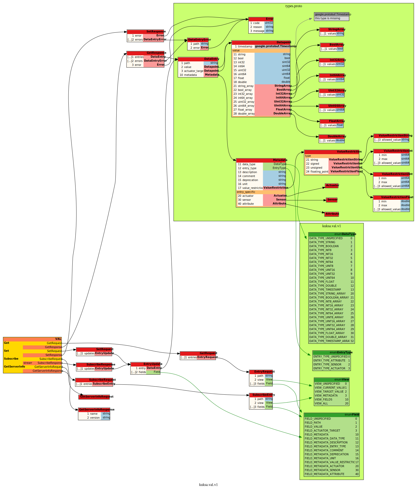

# KUKSA requirements


# Content
- [KUKSA requirements](#kuksa-requirements)
- [Content](#content)
- [Documentation](#documentation)
    - [Terminology](#terminology)
    - [System Architecture](#system-architecture)
- [Functional requirements](#functional-requirements)
    - [As Client](#as-client)
    - [As Databroker](#as-databroker)
    - [As Provider](#as-provider)
- [Non-Functional Requirements](#non-functional-requirements)
  - [Data availability/persistence according to lifecycle of Client, Databroker and Provider](#data-availabilitypersistence-according-to-lifecycle-of-client-databroker-and-provider)
  - [Wildcard support](#wildcard-support)
  - [Registration of Datapoints](#registration-of-datapoints)
  - [Availability of Datapoints](#availability-of-datapoints)
  - [Lifecycle of components](#lifecycle-of-components)
  - [Path requests](#path-requests)
  - [Errors](#errors)
  - [Setting Values](#setting-values)
  - [Atomic operatoins](#atomic-operatoins)
  - [Update notifications](#update-notifications)
  - [Access rights](#access-rights)
  - [VSS signals - Users vs providers](#vss-signals---users-vs-providers)
  - [Enable "easy to use" user facing API](#enable-easy-to-use-user-facing-api)
  - [Performance / runtime footprint](#performance--runtime-footprint)
  - [Throttling-mode when system is overloaded.](#throttling-mode-when-system-is-overloaded)
  - [Considerations regarding shared and zero-copy memory approaches](#considerations-regarding-shared-and-zero-copy-memory-approaches)
  - [Provider control and provider capabilities](#provider-control-and-provider-capabilities)
  - [Control the rate of updates](#control-the-rate-of-updates)
  - [Differentiate between different providers of the same VSS data](#differentiate-between-different-providers-of-the-same-vss-data)
  - [Data Aliveness/Availability](#data-alivenessavailability)
  - [Missing features from `sdv.databroker.v1` in `kuksa.val.v1`](#missing-features-from-sdvdatabrokerv1-in-kuksavalv1)
- [Exploring a design of a bidirectional streaming API](#exploring-a-design-of-a-bidirectional-streaming-api)
    - [Design choices](#design-choices)
        - [Stream](#stream)
        - [Bidirectional stream](#bidirectional-stream)
        - [Actuators](#actuators)
    - [Overview](#overview)
  - [COVESA topics](#covesa-topics)
- [Domain requirements](#domain-requirements)
  - [Interface requirements](#interface-requirements)
    - [Current Databroker API design](#current-databroker-api-design)
    - [New Databroker API proposal](#new-databroker-api-proposal)
- [Appendix](#appendix)
  - [1. Use Cases](#1-use-cases)
  - [2. Protobuf API Diagram](#2-protobuf-api-diagram)

# Documentation
  ### [Terminology](./terminology.md)
  ### [System Architecture](./system-architecture.md)

# Functional requirements

### As Signal Consumer
1. As a client I want to have a single service point accessible from my execution environment.
   
2. As a client I want to `Get` sensor values or actuator current values of the vehicle and its environment in a uniform manner.
  - Details:
    * All sensor and actuator values for which a client has permission to.
    * Client must provide the paths of the requested signals, which optionally may contain wildcards.
    * I want to receive exactly all the signals’ values I requested without errors.
  
3. As a client I want to `Subscribe` to sensor values or actuator current values when some signal value changed -> what about continuous subscription?
  - Details:
    * All sensor and actuator values for which a client has permission to.
    * Client must provide the path, paths or wildcard paths.
    * I want to receive exactly all the signals’ values I requested without errors.

4. As a client I want to `Subscribe` and be able to apply a filter to receive a sensor value with an interval of x milliseconds only if the value has changed.
   
5.  As a client I want to `GetMetadata` static Metadata from signals.
  - Details:
    * All sensors, actuators, and attributes values for which a client has permission to.
    * Client must provide the path, paths or wildcard.

6.  As a client I want to `Get` attributes values once.

7.  As a client I want to `Actuate` a target value of an actuator. This value has to be forwarded to the provider of this actuator if the provider is available, otherwise the target value is lost. 

8.  As a client I want to connect and interact with Databroker either if it contains data or not.

10.  As a client I want to know if there is a provider up and running by getting some sensor or actuator value.

11.  As a client I don’t want to `Subscribe` to target values.

12.  As a client I don’t want to `Subscribe` to attributes values.

13.  As a client I don’t want to `Get` target values.

14.  As a client I don’t want to `Set` sensor values.

15.  As a client I don’t want to `Set` attributes values.

### As Databroker
1. The data broker shall be able to handle catalogs of signals described by the syntax as defined by the COVESA Vehicle Signal Specification (VSS). This relates to all aspects of the VSS syntax definition, which is also called VSS rule set. This implies that the data broker can handle the signal catalog as defined by the COVESA VSS.

2. Databroker shall support at least those metadata elements as defined by the VSS rule set.

### As Provider
1. As a provider I want to `Set` the value and current value of one or many sensors and/or actuators with its timestamp to Databroker.
2. 
3. As a provider I want to `Update` using stream atomically the value and current value of one or many sensors and/or actuators with its timestamp to Databroker.

4. As a provider I want to `Subscribe` to actuator target values requests.

5. As a provider I want to `Set` once attributes values.

6. As a provider I don’t need to but I would like to `Get` sensor values or current values of actuatros?.
   
7. As a provider I don’t want to `Set` target values to Databroker.

# Non-Functional Requirements

## Data availability/persistence according to lifecycle of Client, Databroker and Provider
1. The data broker either ...
   * Stores last set values during its own lifecycle,
   * ? stores values during the system's power cycle (i.e., "persists" values over own restarts, or
   * store values over system's power cycles.

2. How to "reset" values availability if its provider got inactive (without reseting the value)?
   * -> Client's job (e.g. using timestamp)?
   * -> Broker's job (e.g. using timestamp + minimal update cycle)?

3. Provider and client aliveness
   * If there is no active client subscription should the provider stop sending values to Databroker?
   * If there is no active provider setting values while client subscription? Should Databroker or Client be aware of it?

## Wildcard support
* Should `Get` and `Subscribe` calls support Wildcard request?
* Do we want it only for `GetMetadata`?

Reference -> [Wildcard](./wildcard_matching.md)

## Registration of Datapoints
Do we need a method for providers to register data points at runtime? **Implemented in old API?**:

Its purpose would be:
1.	Publishing the availability of new data points during runtime
2.	Claiming providership of those data points


In a mature system some "central instance", e.g., the system integrator must be responsible to ensure that no two components can register/claim providership for any data point.
In case of a registration method the central instance would either have to
  * make sure there is single provider per data point via configuration, or
  * use access rights management to enforce that only the right component can register a certain data point.


## Availability of Datapoints
1. The system must be capable of individually checking the availability of each data point on a specific instance of the data broker. This means verifying whether there is an active provider instance installed on the system where the data broker instance is running, which is capable of supplying the data point during the current update cycle.

2. It shall be possible to determine the availability of the actual value of each data point separately on a certain instance of the data broker.
This represents the information if the provider of that data point is up and running on the system and already provided a value of that data point.


## Lifecycle of components
The proper function of the overall system of components "around" the data broker, i.e., applications, providers, and the broker itself, shall not depend on a certain order of starting the components. This means:
1.	Any clients of the data broker (applications, providers) shall not assume the availability of the data broker service when they startup.
2.	Any clients of the data broker (applications, providers) shall not assume the permanent availability of the data broker service during their runtime.
3.	Any applications/clients shall not assume the availability of a value for any data point at their startup.
4.	Any applications/clients shall not assume the permanent presence of a value for any data point during their runtime.
Explanation: Any component of the system can come and go - components could stop working due to a crash (what should not but will happen) or because of an update (which is a regular use case). Furthermore, components could reside on different execution environments which need restarts at different points of time. This shall not result in stopping and restarting the overall system. Instead, each and every component shall react in an appropriate way on changing availability of its dependencies.

## Path requests
The data broker shall support at least those metadata elements as defined by the VSS rule set. Data points/nodes are (primarily) identified ("addressed") by their name/path which is a string.
VSS arranges nodes in a tree structure, separating elements via a single dot ("."). This shall be supported but must not be a mandatory requirement.
```console
  Vehicle.Speed;
  Vehicle.Seats.Row1.Position;
  ...
```

## Errors
Error response returned by **all gRPC service calls** must be a aligned with [gRPC Error](https://grpc.github.io/grpc/core/md_doc_statuscodes.html).
```protobuf
message Status {
  // The status code, which should be an enum value of [google.rpc.Code][google.rpc.Code].
  int32 code = 1;

  // A developer-facing error message, which should be in English. Any
  // user-facing error message should be localized and sent in the
  // [google.rpc.Status.details][google.rpc.Status.details] field, or localized by the client.
  string message = 2;

  // A list of messages that carry the error details.  There will be a
  // common set of message types for APIs to use.
  repeated google.protobuf.Any details = 3;
}
``` 
Field `details` of type `Any` will be a serialized message as `bytes` containing an internal Databroker [Error](https://github.com/eclipse-kuksa/kuksa-databroker/blob/main/proto/kuksa/val/v1/types.proto#L246):
```protobuf
message Error {
  uint32 code    = 1;
  string reason  = 2;
  string message = 3;
}
```

## Setting Values
1. Attributes: 
   * It shall not be possible to set attribute values, except once at startup time by its respective responsible provider.
2. Sensors: 
   * There shall be only one client able to set the current sensor value during each arbitrary span of time.
3. Actuators:
   * ? Actuator data points have a current and a target value. The current value represents the actual state of the actuator, whereas the target value represents a state desired by that client, who most recently set that target value. 
   * Only one client shall be able to set the current actuator value during each arbitrary span of time. This client is the provider of the data point.
   * Multiple client may be able to set the target value of an actuator.
   * Only the current provider client shall react on setting a new target value. It is expected that the provider tries to bring the current state of an actuator into the state requested by the target value. If this is not possible (for some reason), the provider is responsible to reset the state of the target value to that of the current value of the same data point. 
     -> This actually not a requirement to the data broker, but to the overall "usage concept" around the broker.
   *? If no (active) provider is available for an actuator data point, its current and target value shall be "unavailable". A set request to a target value shall be "ignored" and the resulting target and current value shall stay as "unavailable".

## Atomic operatoins
All data point values set by a single request must be updated in an atomic manner. This means:
1. Set requests must be handled strongly sequentially in the order of reception.

2. Responses to get requests and notifications on behalf of active subscriptions must represent the state of data points in-between finished set requests, i.e., a single set request (updating multiple data points) must not be interfered with get requests or update notifications.

## Update notifications
1. Update notifications for active subscriptions of multiple data points shall always contain the state of all data points of the subscription even if just one value has changed.
   
2. If this behavior is not wanted by a client, it must subscribe data points separately.

## Access rights
1.	Sensor (-like) data points: Its value shall be set be a single provider only (at least at a time)

2.	Actuator (-like) data points: Multiple clients may set its (target) value, a single client may act on its last set (target) value and "reset" it. Only a single client must set its current value (if there is a distinguishing).
Hint: This does not necessarily need to ensured via the "API design" - it could also be ensured via access rights management configuration.


## VSS signals - Users vs providers

The Vehicle Signals Specification (VSS) and Vehicle Information Service Specification (VISS) describes the standardized signals available (or not) in a vehicle. Both standards also describe how users interact with these signals.

* They can read and subscribe to [actuators, sensors](https://covesa.github.io/vehicle_signal_specification/rule_set/data_entry/actuatorssensor_actuator/) and [attributes](https://covesa.github.io/vehicle_signal_specification/rule_set/data_entry/attributes/).
* They can set [actuators](https://covesa.github.io/vehicle_signal_specification/rule_set/data_entry/sensor_actuator/).) (and only actuators).
  For VISSv2 specifically, see ([read](https://w3c.github.io/automotive/spec/VISSv2_Core.html#read), [subscribe](https://w3c.github.io/automotive/spec/VISSv2_Core.html#subscribe)), [update](https://w3c.github.io/automotive/spec/VISSv2_Core.html#update))).

VSS and VISS does _not_ specify how signals are provided _into_ the VSS server / model.

These two aspects of interacting with the signals can thus be divided into:
* **Provider**<br>
  _A provider is providing a signal (sensor, attribute or actuator) to the VSS tree._<br>
  _A provider can also use signals as any other user._

* **User**<br>
  _A user (or client) is using the signals in the VSS tree (without providing any of them itself)._

where the VSS and VISS* specifications only specify the **User** part.

When designing the databroker API, the method kuksa.val uses for providing signals was investigated. In short, kuksa-val-server takes the approach of trying to shoehorn the need of signal providers into the existing VISSv2 protocol. This is problematic for several reasons:

* By reusing, **but changing the meaning** of the terminology used in VSS, there is a constant dissonance between the terms used. This is a recipe for confusion.
* By deviating from the standard in _this particular way_, a standards compliant VISSv2 client cannot use it in any meaningful way.
* It makes it harder to actually provide a standards compliant VISSv2 in the future .
* By using the same methods for both signal providers _and_ users of signals it's harder (or impossible) to customize them for their different requirements.

With this in mind, databroker chose to make a clear distinction between signal providers and signal users. It doesn't use this terminology though. It does this by splitting the interface into two separate services, which are customized for their different requirements / use cases. It doesn't need to be implemented in this way in order to achieve the same design goal, though.

## Enable "easy to use" user facing API

This is meant to illustrate what type of user APIs that can be created depending on what the provider API looks like (assuming we have one).

Use case:

The user wants to lock a door and know when it's done / whether it worked.

**The kuksa.val.v1 or "key-value store" way.**

Something conceptually like this:
1. User calls `set(Vehicle.Door.Locked, field=TARGET_VALUE, true)`
2. User calls `subscribe(Vehicle.Door.Locked, field=VALUE)`
3. Provider (subscribing to TARGET_VALUE) receives the request and starts actuating, providing VALUE when it changes.
4. User is notified when VALUE turns to true, and concludes that the door has now been locked.

But what happens if the door fails to lock, e.g. the door is not close or the actuator is broken?
* What should the user subscribe to for this information?
* And how long should it wait before concluding that it failed?
* And what happens if there is no provider of this actuator?

Another question, a bit convoluted for a quick actuator like this (but applicable for slower moving things), is happens if another user calls set(..., false) before the actuator change has taken place?

This can be solved by subscribing to both VALUE and TARGET_VALUE.

1. User calls `set(Vehicle.Door.Locked, field=TARGET_VALUE, true)`
2. User calls `subscribe(Vehicle.Door.Locked, fields=[VALUE, TARGET_VALUE])`
3. Provider (subscribing to TARGET_VALUE) receives the request and starts actuating, providing VALUE when it changes.
4. User is notified when VALUE turns true, and concludes that the door has now been locked, or the user is notified when TARGET_VALUE turns false, and knows that the operation was cancelled.


**The user API + provider API way.**

So what could this look like if we instead had an "easy to use" user API + a provider API and the server in between.

Something like this:
1. User calls `set(Vehicle.Door.Locked, true)`
2. Server receives the request and sends an ACTUATOR_TARGET value to the provider of this signal.
3. The provider receives it and starts actuating and provides VALUE back to the server when it changes.
4. The provider sends "actuator target reached" back to the server.
5. The server sends a (success) response back to the client.

Or in case of failure:

User calls `set(Vehicle.Door.Locked, true)`
1. Server receives the request and sends an ACTUATOR_TARGET value to the provider of this signal.
2. The provider receives it and starts actuating but notice that it fails, or that it's not allowed at the moment.
3. The provider sends "actuator failed" or something back.
4. The server sends a response "actuator failed" back to the client.

Or if there are no providers.
1. User calls `set(Vehicle.Door.Locked, true)`.
2. The server knows that there are no providers, providing that signal.
3. The server sends a response "actuator failed" or "not available" back to the client

This latter approach would seem to represent an easier to use API for the user/library.

**Note**
Doing it like this puts the requirement to know the details of the actuator on the actuator provider.

The actuator provider is better suited to know of reasonable timeouts etc in comparison to the users of signals (or the server). The user doesn't need to know how long to wait for something or to which error to subscribe. The server would only have to handle the presence detection which is a generic feature that doesn't require knowledge of sensor specifics.


## Performance / runtime footprint
Providers, especially of sensor data, are often setting values in rapid succession over long periods of time. Using unary GRPC calls for `Set` operations, is less efficient in terms of throughput when compared to GRPC streams. It's also more CPU intensive.

The current design of `kuksa.val.v1` only provides unary call to set values. This represents a pure regression when compared to the databroker API.

It's not a huge issue (in practice) if users avoid using `kuksa_client.KuksaClientThread()`. If they use that, I would say it's barely usable for e.g. CAN in it's current form.

**Python performance setting signal values**

| Set only                    | type  |    throughput  |
|-----------------------------|-------|---------------:|
| kuksa_client <sup>(1)</sup> |       |   ~     80 / s |
| kuksa.grpc   <sup>(2)</sup> | async |   ~  2 500 / s |
| kuksa.val.v1 <sup>(3)</sup> | async |   ~  6 500 / s |
| kuksa.val.v1 <sup>(3)</sup> | sync  |   ~  9 000 / s |
| databroker   <sup>(4)</sup> | sync  |   ~ 26 000 / s |

<sup>1</sup> kuksa_client is using `kuksa_client.KuksaClientThread()`

<sup>2</sup> kuksa.grpc is using `kuksa_client.grpc` without the legacy `kuksa_client.KuksaClientThread()` wrapping it

<sup>3</sup> uses the generated `val_pb2*.py` python lib directly

<sup>4</sup> uses the generated `collector_pb2*.py` python lib directly


Improvements:
* Higher throughput.
* Reduced CPU load.
* Lower latency (probably, hasn't been measured)

What's needed:
* Introduce a streaming (GRPC) interface for providing sensor data.

## Throttling-mode when system is overloaded.
Is it worth to consider some throttling mode to be activated by the user in case system or any component is overloaded?
Throttling modes to think about:
  * Rate Limiting
  * Bandwidth Throttling
  * CPU Throttling

## Considerations regarding shared and zero-copy memory approaches
Pros:
Cons:

## Provider control and provider capabilities

Open questions:

Should the "change type" of a sensor (i.e. CONTINUOUS vs ON_CHANGE) be decided by providers
or in the VSS metadata?
It only makes sense for consumers to request their preferred rate of updates when they are
subscribing to a sensor of type CONTINUOUS. That would be an argument for providing this
information as part of the VSS metadata, so that it doesn't vary between vehicles.

## Control the rate of updates

Users of (continuous) sensor data can have different preferences with regard to how often
they would like to receive updates. E.g. Vehicle.Speed is updated 100 times per second, but
a consumer would only need it 1 time per second. This would introduce unnecessary processing
requirements on the consumer (and provider).

Currently there is no way for databroker to know how often a provider should provide updates.
There is also no way for clients to instruct databroker of what rate they want.
Sensor data is just sent at the rate it is received and providers are just sending sensor data at the rate
they themselves decide.

If a consumer can communicate this wish, there are several options for improvement.

Improvements:
* Reduction in load for consumers by adapting the update rate based on their preferences.
* Reduction in load for for providers by propagating needed update rate.
* Reduction in load for databroker by disabling unneeded providers.

What's needed:
* Introduce a way for clients to tell databroker of their preferred rate of updates.
* Introduce a way for databroker to tell providers of highest needed frequency of sensor
  data to which they can then adapt.
  [probably needs] open stream `databroker` -> `provider`

Other considerations:

Setting the desired rate of update would only make sense for sensors of type CONTINUOUS.
Sensors of type ON_CHANGE would always provide updates when the value changes.
It could also make sense to introduce a way to request a momentary value from a provider,
which would be used if a consumer only requests a momentary value (and doesn't subscribe).


## Differentiate between different providers of the same VSS data

Different sensors can provide data that is mapped to the same VSS signal / entry.
This data can be of different resolution and / or quality. For example, an accelerometer
can be used to infer the current speed of a vehicle, but a speedometer would probably
provide a higher quality measurement. In the same way that a consumer could instruct
databroker of a preferred update rate, it could also instruct the databroker of what
accuracy of a sensor it needs.

It's currently possible for multiple providers to set the same VSS entry, but there is no
way for databroker to differentiate between them in any way.

It could make sense to introduce a way for providers to describe themselves in order to
make it possible to differentiate between them with regard to update rates, power consumption, accuracy or quality of their sensor data.

This would give databroker the clients a way to to differentiate (and choose) different
sources of data and make informed decisions based on that.

Improvements:
* Choose between providers based on available update frequency.
* Fallback when sensor information from one sensor isn't available.

What's needed:
* Introduce a way for providers to describe their capabilities and properties of their
  provided sensor data.

Optional improvements:
* Choose between providers based on needed quality / accuracy of sensor.
  [needs] control plane, i.e. an open stream `databroker` -> `provider`
* Consumers can get extended sensor data information.

Optionally needed:
* Introduce a way for consumers to tell databroker of their needed quality / accuracy
  of VSS signal.


## Data Aliveness/Availability

The VSS signals / datapoints that are accessed through databroker can have a value and a
timestamp. If they have never been set, they will have neither.

There is no way for databroker to know if a value is up to date or not, since it doesn't
have any information with regard to how often it should be updated or a way to determine
if a provider has stopped providing data.

For signals with a fixed update rate (sensors of type CONTINUOUS), it would theoretically
be possible for either clients or the databroker to determine if a signal is up to date,
by keeping track of the time since the last update.

The providers of sensor data would be better suited to know the rate of update, and if
the databroker where provided this information, it could automatically determine if a
sensor hasn't been update within it's expected time window.

For signals that only update based on events (i.e. a door opens), this isn't possible.
Tracking the liveness of these signals would either require the providers to continuously
send the same value even though it hasn't changed, or to have an open connection or
another heartbeat mechanism between databroker and the provider to detect a missing provider.

If there was a way to determine the availability of providers, the databroker could
automatically determine that a signal was stale if it's provider is no longer available.

Improvements:
* Track availability / liveness of a VSS signals.

What's needed:
* Introduce a way to signal that a signal is available / not available (in `kuksa.val.v1`).
* Introduce a way for providers to tell databroker of a signals time to live (TTL).
* Introduce a way for databroker to track availability of providers (and which VSS signals
  they are providing).
  [needs] an open stream `provider` -> `databroker` or `databroker` -> `provider`
* Implement tracking of TTL in databroker to automatically set unavailable status to signals
  that have not been updated in time.


Other considerations:
Attributes probably don't need to have aliveness functionality. They would be
unavailable if they have never been set, but since they shouldn't update at runtime,
once set they should be valid indefinitely.


## Missing features from `sdv.databroker.v1` in `kuksa.val.v1`
Sort list: What features would be lost if removing sdv.databroker.v1 today
 * Registration of new datapoints
 * SQL queries
 * Streaming updates (i.e. worse performance)
 * Connectivity check (no streaming interface)


# Exploring a design of a bidirectional streaming API

This represent one way to design an interface that would enable most of the improvements
listed above and provide a clear path forward for introducing them.


### Design choices

In this design, a single bidirection stream is used to provide everything needed by
providers:
`rpc Provide(stream ProviderRequest) returns (stream ProviderResponse);`
 
This combines the control channel and the data channel into one. An alternative
would be to split it into two bidirectional streams, one for control and the other
for data. I'm not sure which makes the most sense.

##### Stream
By having an open stream (at all) between databroker and the provider, both ends
can detect if the other goes away.

Furthermore:

A stream from provider -> databroker:
- Enables higher throughput for sensor data updates and lower CPU usage.

A stream from databroker -> provider:
- Provides a way for databroker to send control commands to this provider.
- Provides a way for databroker to send errors to this provider.

##### Bidirectional stream

A bidirectional stream between Provider <-> databroker
- Provides databroker with a way to associate information sent from the provider
  (e.g. capabilities, which actuators it provides, which sensors etc) with the stream
  it uses to control it.

##### Actuators
VSS defines three types of signals:
* Attribute
* Sensor
* Actuator

An actuator acts as both something you can actuate and something providing values (a sensor).
It's not even necessarily the same component providing the implementation of these separate concerns. With this in mind, a provider providing an VSS actuator would in this design provide
an `Actuator(path)` to the server in order to receive `ActuateCommand`s, and provide
`Sensor(path)` and send `SensorData` when they are providing sensor data.

The alternative would be to duplicate everything in `Sensor` for `Actuator`s.


### Overview
The stream in each direction would consist of different "messages" implemented with `oneof {...}`.

In the direction of *Provider -> Server*, at least three types of "messages" would flow<sup>(2)</sup>:
* `SensorData` containing data streamed by the provider.
* `Sensor` containing sensor information from the provider.
* `Actuator` containing actuator information from the provider.
* `Attribute` containing attribute including the value. <sup>(1)</sup>

In the direction of *Server -> Provider*, at least three types of "messages" would flow:
* `ActuateCommand`, tells actuator to actuate (triggered by someone setting actuator targets).
* `SensorCommand`, controls behaviour of a sensor, i.e.
   "start", "stop", "try to use this update frequency" etc..
* `Error`, an error occurred. One type at the moment. It would probably make sense to
   split it into errors that can occur at any time & errors that are directly caused by
   things the provider provided.

<sup>(1)</sup> It would probably make sense to introduce a separate `Error` in the direction of
    *Provider -> Server*. Currently, the only errors in that direction is `ReadError` as part of the
    sensor data.

<sup>(2)</sup> It's possible that it makes mores sense to provide a separate unary RPC call for setting attributes,
    since attributes (probably) don't update frequently and (probably) wont need availability status etc..

```proto
service VAL {
  ...
  rpc Provide(stream ProviderRequest) returns (stream ProviderResponse);
}

message ProviderRequest {
  oneof provide {
    Sensor sensor = 1;
    Actuator actuator = 2;
    Attribute attribute = 3;
    SensorData sensor_data = 4;
  }
}

message ProviderResponse {
  oneof command {
    ActuateCommand actuator_command = 1;
    SensorCommand sensor_command = 2;
    Error error = 3;
  }
}

...

```

The full `.proto` specification for this proposal can be found [here](https://github.com/boschglobal/kuksa.val/blob/feature/provider_api/kuksa_databroker/proto/sdv/databroker/v1/provider.proto).

In the same branch there is a working prototype of a [client](https://github.com/boschglobal/kuksa.val/blob/feature/provider_api/python/provider/provider.py) and [server](https://github.com/boschglobal/kuksa.val/blob/feature/provider_api/python/provider/provider_endpoint.py) showcasing its usage.

This includes:
* Rate control
* Sending Start / Stop instruction to the provider
* Availability detection of providers
* Availability detection of server

It also showcases that it's possible to wrap this GRPC interface in a simple library for users, i.e.
```python
    provider = Provider()
    provider.start()
    for speed in read_current_speed():
        provider.set("Vehicle.Speed", speed)

    provider.stop()

```
## COVESA topics


# Domain requirements
## Interface requirements
### Current Databroker API design
```protobuf
service VAL {
  rpc Get(GetRequest) returns (GetResponse);

  rpc Set(SetRequest) returns (SetResponse);

  rpc Subscribe(SubscribeRequest) returns (stream SubscribeResponse);

  rpc GetServerInfo(GetServerInfoRequest) returns (GetServerInfoResponse);
}

message EntryRequest {
  string path                     = 1;
  View view                       = 2;
  repeated Field fields           = 3;
}

message GetRequest {
  repeated EntryRequest entries   = 1;
}

message GetResponse {
  repeated DataEntry entries      = 1;
  repeated DataEntryError errors  = 2;
  Error error                     = 3;
}

message EntryUpdate {
  DataEntry entry                 = 1;
  repeated Field fields           = 2;
}

message SetRequest {
  repeated EntryUpdate updates    = 1;
}

message SetResponse {
  Error error                     = 1;
  repeated DataEntryError errors  = 2;
}

message SubscribeEntry {
  string path                     = 1;
  View view                       = 2;
  repeated Field fields           = 3;
}

message SubscribeRequest {
  repeated SubscribeEntry entries = 1;
}

message SubscribeResponse {
  repeated EntryUpdate updates    = 1;
}

message GetServerInfoRequest {
  // Nothing yet
}

message GetServerInfoResponse {
  string name                     = 1;
  string version                  = 2;
}

``` 

### New Databroker API proposal
**Change History**:
* Added:
  * service method -> **`rpc Update(stream SetRequest) returns (SetResponse);`**
  * service method -> **`rpc Actuate(ActuateRequest) returns (ActuateResponse);`**
  * service method -> **`rpc GetMetadata(MetadataRequest) returns (MetadataResponse);`**
  * message -> **`ActuateRequest`**
  * message -> **`ActuateResponse`**
  * message -> **`MetadataRequest`**
  * message -> **`MetadataResponse`**
  
* Removed:
  * field -> **`repeated DataEntryError errors`** from **`GetResponse`**
  * fielf -> **`repeated DataEntryError errors`** from **`SetResponse`**

```protobuf
service VAL {
   // get the (current) value of attributes, sensors and actuators
  rpc Get(GetRequest) returns (GetResponse);

  // set the (current) value of attributes(?), sensors and actuators - for low update frequency
  rpc Set(SetRequest) returns (SetResponse);

  // set the (current) value of attributes(?), sensors and actuators - for high update frequency
  rpc Update(stream SetRequest) returns (SetResponse);

  // subscribe for notifications on updates of (current) values of attributes(?), sensors and actuators
  rpc Subscribe(SubscribeRequest) returns (stream SubscribeResponse);

  // request target values of actuators to be set
  rpc Actuate(ActuateRequest) returns (ActuateResponse);

  // get static metadata
  rpc GetMetadata(MetadataRequest) returns (MetadataResponse);

  rpc GetServerInfo(GetServerInfoRequest) returns (GetServerInfoResponse);
}

message EntryRequest {
  string path                     = 1;
  View view                       = 2;
  repeated Field fields           = 3;
}

message GetRequest {
  repeated EntryRequest entries   = 1;
}

message GetResponse {
  repeated DataEntry entries      = 1;
  Error error                     = 1;
}

message EntryUpdate {
  DataEntry entry                 = 1;
  repeated Field fields           = 2;
}

message SetRequest {
  repeated EntryUpdate updates    = 1;
}

message SetResponse {
  Error error                     = 1;
}

message SubscribeEntry {
  string path                     = 1;
  View view                       = 2;
  repeated Field fields           = 3;
}

message SubscribeRequest {
  repeated SubscribeEntry entries = 1;
}

message SubscribeResponse {
  repeated EntryUpdate updates    = 1;
}

message ActuateRequest {
  EntryUpdate actuator = 1;
}

message ActuateResponse {
  Error error                     = 1;
}

message MetadataRequest {
  repeated string path            = 1;
}

message MetadataResponse {
  repeated DataEntry metadata     = 1;
}

message GetServerInfoRequest {
  // Nothing yet
}

message GetServerInfoResponse {
  string name                     = 1;
  string version                  = 2;
}
``` 

# Appendix

## 1. [Use Cases](./kuksa_use_cases.md)

## 2. Protobuf API Diagram
