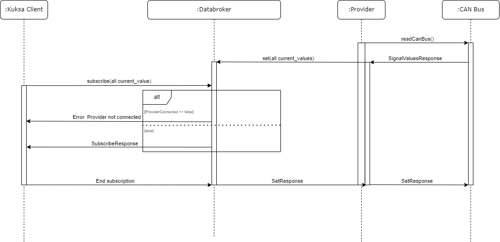
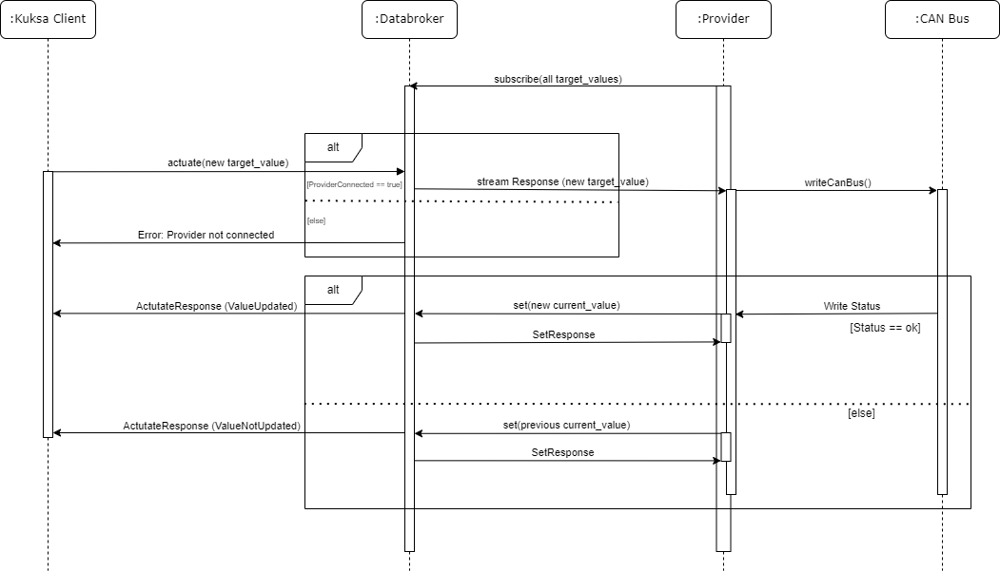
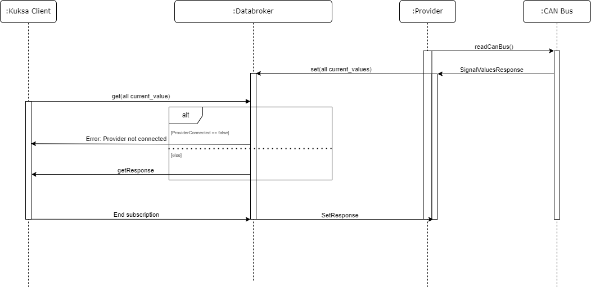
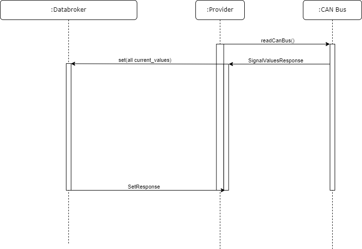
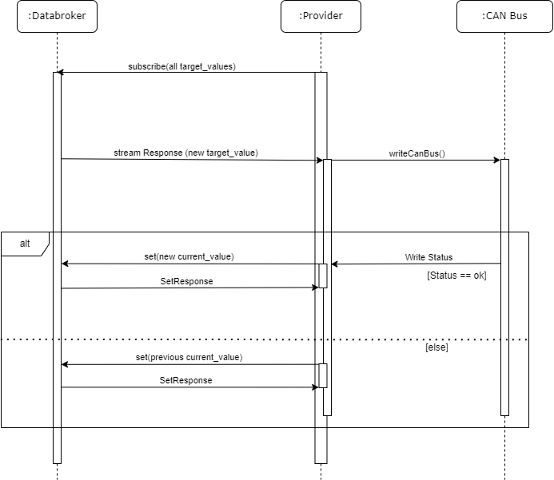

# KUKSA Use Cases

# Content
- [KUKSA Use Cases](#kuksa-use-cases)
- [Content](#content)
- [Use cases:](#use-cases)
  - [1. Kuksa client subscribes on changed sensor values or actuator current values of all signals](#1-kuksa-client-subscribes-on-changed-sensor-values-or-actuator-current-values-of-all-signals)
  - [2. Kuksa client sets a target value for an actuator.](#2-kuksa-client-sets-a-target-value-for-an-actuator)
  - [3. Kuksa client gets sensor values or actuator current values of all signals.](#3-kuksa-client-gets-sensor-values-or-actuator-current-values-of-all-signals)
  - [4. As a provider, I want to update atomically on Databroker, all sensor values as fast as possible.](#4-as-a-provider-i-want-to-update-atomically-on-databroker-all-sensor-values-as-fast-as-possible)
  - [5. As a provider, if I receive a target value update through a subscription to the databroker, I want to modify the target value on the CAN bus and update the current value to the databroker if the operation is successful.](#5-as-a-provider-if-i-receive-a-target-value-update-through-a-subscription-to-the-databroker-i-want-to-modify-the-target-value-on-the-can-bus-and-update-the-current-value-to-the-databroker-if-the-operation-is-successful)

# Use cases:

## 1. Kuksa client subscribes on changed sensor values or actuator current values of all signals

**Primary Actor:** Kuksa client

**Secondary Actors:** Databroker, Provider, CAN 

**Priority**: High

**Preconditions:**
 * Provider open CAN Bus connection and start receiving signal values.
 * Provider sets sensor values or actuator current values to Databroker atomically. -> NFR (1.7)
 * Kuksa client contains a valid authentication token to connect and perform calls to databroker.

**Special requirements:**
 * The use case must meet the Performance NRF (3.17)
 * What if provider died?

**Assumptions:**
 * Client wants to subscribe to all the possible sensor values or actuator current values to test special requirements.
 * Provider set new signals values to Databroker as fast as receives data from CAN bus.

**Postconditions:**
 * A subscription is created, and client receives streaming of signals.

**Sequence diagram:**

**Basic Flow:**
1.	Kuksa client subscribe to all the sensor values or current values of actuators.
2.	Kuksa client start receiving streaming of data.
3.	Use case finishes.

**Alternative Flows**:
* Flow 1.
2.	Databroker return error response since provider is not connected???
3.	Use case finishes.

**Exceptions:**

## 2. Kuksa client sets a target value for an actuator.

**Primary Actor:** Kuksa client

**Secondary Actors:** Databroker, Provider, CAN Bus

**Priority:** High

**Preconditions:**
* Provider is connected to some CAN Bus.
* Provider started sending signals current values to Databroker before the use case starts.
* Provider subscribes to target values coming from Databroker.
* Kuksa client contains a valid authentication token to connect and perform calls to databroker.

**Special requirements:**

**Assumptions:**

**Postconditions:**
* Client receives a response whose status indicates the operation was successfully executed.
* Databroker stores on his database the new target value for the actuator.
* Provider writes the new target value in CAN bus.

**Sequence diagram:**

**Basic Flow:**
1.	Kuksa client calls actuate with a valid actuator path and keeps waiting for a response.
2.	Databroker checks if a Provider is connected.
3.	Databroker changes its internal target value for the corresponding actuator path with the current timestamp. (Assumption -> Current value remains the same)
4.	Databoker notifies all subscriptions to target values.
5.	Provider subscribes to target values on Databroker.
6.	Provider receives target value notification upon previous subscription.
7.	Provider serializes VSS target value to CAN Bus and sends the value to the Bus.
8.	Provider receives response and set the new current value to Databroker.
9.	Databroker notifies Kuksa client with the result of the operation.
10.	Use case finishes.

**Alternative Flows:**
* Flow 1.
2.	Databroker checks if a Provider is connected.
3.	If no Provider is connected to Databroker, it returns an error.
4.	Use case finishes.

* Flow 2.
8.	Provider receives error response and set the previous current_value to Databroker.
9.	Databroker what should do? Check timestamp?

**Exceptions:**

## 3. Kuksa client gets sensor values or actuator current values of all signals.

**Primary Actor:** Kuksa client

**Secondary Actors:** Databroker, Provider, CAN Bus

**Priority:** High

**Preconditions:**
* Provider can read from CAN Bus.
* Provider starts sending sensor values or actuator current values to Databroker before the Client subscribes.
* Kuksa client contains a valid authentication token to connect and perform calls to databroker.

**Special requirements:**

**Assumptions:**
* Client wants to get to all the possible sensor values or actuator current values to test special requirements.

**Postconditions:**
* Client receives a vector with all datapoints requested.

**Sequence diagram:**

**Basic Flow:**
1.	Provider open CAN Bus connection and start receiving signal values.
2.	Provider sets sensor values or actuator current values to Databroker atomically. -> NFR (1.7)
3.	Kuksa client calls get call to all the sensor values or current values of actuators.
4.	Kuksa client response which contains a vector of datapoints.
5.	Use case finishes.

**Alternative Flows:**
* Flow 1.
4.	Kuksa client calls get call to all the sensor values or current values of actuators.
5.	Databroker return error response since provider is not connected???
6.	Use case finishes.

**Exceptions:**

## 4. As a provider, I want to update atomically on Databroker, all sensor values as fast as possible.

**Primary Actor:** Provider

**Secondary Actors:** Databroker, CAN Bus

**Priority:** High

**Preconditions:**
* Provider can stablish a CAN Bus connection.

**Special requirements:**
* Provider sets sensor values to Databroker atomically. -> NFR (1.7)

**Assumptions:**
* There is an instance of Databroker up and running.

**Postconditions:**
* Databroker stores on database all the sensor values.

**Sequence diagram:**

**Basic Flow:**
1.	Provider open CAN Bus connection and start receiving signal values.
2.	Provider sets sensor values to Databroker atomically. -> NFR (1.7)

**Alternative Flows:**

**Exceptions:**

## 5. As a provider, if I receive a target value update through a subscription to the databroker, I want to modify the target value on the CAN bus and update the current value to the databroker if the operation is successful.

**Primary Actor:** Provider

**Secondary Actors:** Databroker, CAN Bus

**Priority:** High

**Preconditions:**

**Special requirements:**

**Assumptions:**
* Provider can stablish a CAN Bus connection.
* There is an instance of Databroker up and running.
* Provider is aware of all possible signals to subscribe by calling up front get metadata.

**Postconditions:**
* Databroker receives a subscription stream to start receiving target values of actuators.

**Sequence diagram:**

**Basic Flow:**
1.	Provider subscribes to target values on Databroker.
2.	Provider receives target value notification upon previous subscription.
3.	Provider serializes VSS target value to CAN Bus and sends the value to the Bus.
4.	Provider receives response and set the new current value to Databroker.
5.	Databroker notifies Kuksa client with the result of the operation.
6.	Use case finishes.

**Alternative Flows**
* Flow 1.**
4.	Provider receives error response and set the previous current_value to Databroker.
5.	Databroker what should do? Check timestamp?

**Exceptions:**

